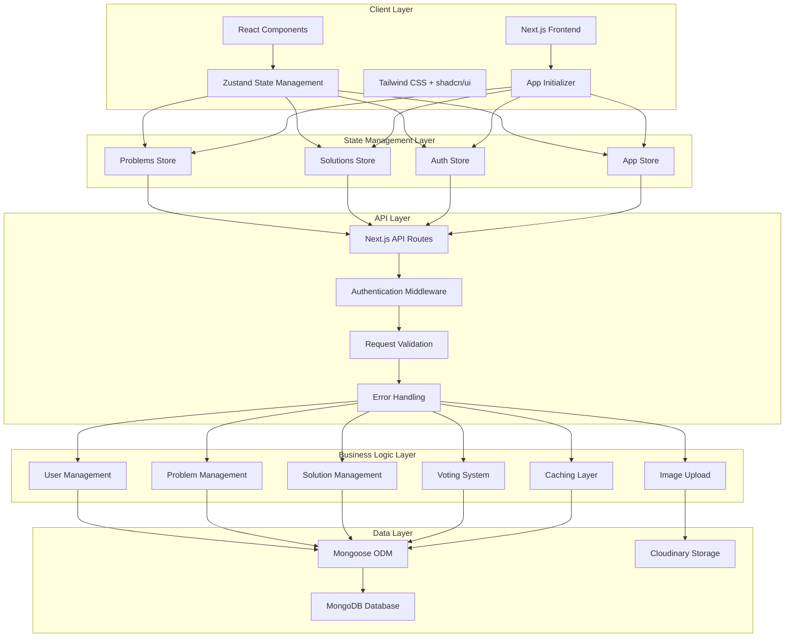

# CrowdSolve - Application Architecture

## Overview

CrowdSolve is a community-driven problem-solving platform built with Next.js 14, TypeScript, and MongoDB. It enables users to post real-world problems and collaborate to find practical solutions through a voting and acceptance system similar to Stack Overflow.

## High-Level Architecture



## Technology Stack

### Frontend
- **Framework**: Next.js 14 (App Router)
- **Language**: TypeScript
- **UI Library**: shadcn/ui + Radix UI
- **Styling**: Tailwind CSS v4
- **State Management**: Zustand
- **Icons**: Lucide React
- **Animations**: Tailwind CSS Animations

### Backend
- **Runtime**: Node.js
- **Framework**: Next.js API Routes
- **Database**: MongoDB
- **ODM**: Mongoose
- **Authentication**: JWT with jose
- **File Storage**: Cloudinary
- **Password Hashing**: bcryptjs

### Development Tools
- **Package Manager**: pnpm
- **Linting**: ESLint
- **Type Checking**: TypeScript
- **Build Tool**: Next.js

## System Architecture

### 1. Client-Side Architecture

#### Component Hierarchy
```
App Layout
├── ThemeProvider
├── AuthProvider
├── Navbar
│   ├── Logo
│   ├── Navigation Links
│   └── User Dropdown
├── Main Content
│   ├── HomePage
│   ├── ProblemsPage
│   ├── ProblemDetail
│   ├── UserProfile
│   └── SettingsPage
└── Toaster (Notifications)
```

#### State Management
- **Global State**: Multiple Zustand stores for different domains
  - **Auth Store**: User authentication and session management
  - **Problems Store**: Problems data with caching and pagination
  - **Solutions Store**: Solutions data with voting and real-time updates
  - **App Store**: Application-wide settings and notifications
- **Local State**: React useState for component-specific state
- **Server State**: Intelligent caching with automatic refresh detection
- **Persistence**: Zustand persist middleware for cross-session state

### 2. Server-Side Architecture

#### API Route Structure
```
/api
├── auth/
│   ├── login
│   ├── register
│   ├── logout
│   └── me
├── problems/
│   ├── [id]/
│   │   ├── route.ts (GET, PATCH)
│   │   └── solutions/
│   │       └── route.ts (GET, POST)
│   └── route.ts (GET, POST)
├── solutions/
│   └── [id]/
│       ├── route.ts (GET, PATCH, DELETE)
│       ├── vote/
│       └── accept/
├── users/
│   ├── [username]/
│   ├── profile/
│   └── avatar/
└── upload/
```

#### Middleware
- **Authentication**: JWT token verification with username extraction
- **Route Protection**: Protected routes redirect to login
- **Auth Routes**: Redirect authenticated users to their profile page
- **Landing Page**: Redirect authenticated users to profile page
- **Profile Redirection**: Smart redirection based on JWT payload

### 3. Database Architecture

#### Collections
1. **Users**
   - Authentication data
   - Profile information
   - Reputation system

2. **Problems**
   - Problem details
   - Author references
   - Status tracking

3. **Solutions**
   - Solution content
   - Problem references
   - Voting data

4. **Votes**
   - User-solution relationships
   - Vote types (upvote/downvote)

#### Relationships
```
User 1:N Problems
User 1:N Solutions
Problem 1:N Solutions
Solution 1:N Votes
User 1:N Votes (on Solutions)
```

## Data Flow

### 1. Authentication Flow
```
1. User submits login/register form
2. Frontend sends request to /api/auth/login or /api/auth/register
3. Server validates credentials
4. Server creates JWT token
5. Server sets httpOnly cookie
6. Frontend updates auth state
7. User is redirected to appropriate page
```

### 2. Problem Creation Flow
```
1. User fills problem form
2. Images uploaded to Cloudinary via /api/upload
3. Problem data sent to /api/problems
4. Server validates and saves to MongoDB
5. Frontend updates problem list
6. User redirected to problem detail page
```

### 3. Solution Voting Flow
```
1. User clicks vote button
2. Frontend sends request to /api/solutions/[id]/vote
3. Server checks if user already voted
4. Server updates vote count and user vote record
5. Frontend updates UI with new vote count
```

## Security Architecture

### 1. Authentication
- **JWT Tokens**: Secure token-based authentication
- **HttpOnly Cookies**: Prevents XSS attacks
- **Password Hashing**: bcryptjs with salt rounds
- **Session Management**: Server-side token validation

### 2. Authorization
- **Route Protection**: Middleware-based route guarding
- **API Protection**: Session validation on protected endpoints
- **User Context**: User ID from JWT for data access control

### 3. Data Validation
- **Input Validation**: Server-side validation on all inputs
- **File Upload Security**: Type and size validation
- **SQL Injection Prevention**: Mongoose ODM protection
- **XSS Prevention**: Input sanitization

## Performance Optimizations

### 1. Frontend
- **Code Splitting**: Next.js automatic code splitting
- **Image Optimization**: Next.js Image component
- **Lazy Loading**: Dynamic imports for heavy components
- **Caching**: Browser caching for static assets
- **State Caching**: Zustand persist with intelligent refresh detection
- **Optimistic Updates**: Real-time UI updates with rollback on error
- **Request Deduplication**: Prevents duplicate API calls

### 2. Backend
- **Database Indexing**: Optimized queries with proper indexes
- **Connection Pooling**: MongoDB connection management
- **File Upload**: Direct Cloudinary uploads
- **Pagination**: Efficient data loading
- **Error Handling**: Comprehensive error responses with proper HTTP status codes
- **Request Timeouts**: 10-second timeouts for all API calls
- **Data Normalization**: Consistent data structures across all endpoints

### 3. Database
- **Indexes**: Strategic indexing on frequently queried fields
- **Aggregation**: Efficient data aggregation for stats
- **Lean Queries**: Minimal data transfer with .lean()

## Scalability Considerations

### 1. Horizontal Scaling
- **Stateless Design**: No server-side sessions
- **Database Sharding**: MongoDB sharding capabilities
- **CDN Integration**: Cloudinary CDN for images
- **Load Balancing**: Multiple server instances

### 2. Vertical Scaling
- **Memory Management**: Efficient state management
- **Database Optimization**: Query optimization
- **Caching Strategy**: Redis for session caching (future)
- **Image Optimization**: Cloudinary transformations

## Deployment Architecture

### 1. Development
- **Local Development**: Next.js dev server
- **Database**: Local MongoDB or MongoDB Atlas
- **File Storage**: Cloudinary development account

### 2. Production
- **Hosting**: Vercel (recommended) or similar
- **Database**: MongoDB Atlas
- **File Storage**: Cloudinary production account
- **CDN**: Vercel Edge Network + Cloudinary CDN

### 3. Environment Configuration
```env
# Database
MONGODB_URI=mongodb+srv://...

# Authentication
JWT_SECRET=your-secret-key

# File Storage
CLOUDINARY_CLOUD_NAME=your-cloud
CLOUDINARY_API_KEY=your-key
CLOUDINARY_API_SECRET=your-secret
```

## Monitoring and Logging

### 1. Error Handling
- **Client-Side**: Try-catch blocks with user feedback
- **Server-Side**: Centralized error logging
- **API Responses**: Consistent error response format

### 2. Performance Monitoring
- **Vercel Analytics**: Built-in performance monitoring
- **Database Monitoring**: MongoDB Atlas monitoring
- **Error Tracking**: Console logging with structured format

## Future Enhancements

### 1. Short Term
- **Real-time Updates**: WebSocket integration
- **Push Notifications**: Browser notifications
- **Search Enhancement**: Full-text search with MongoDB
- **Mobile App**: React Native version

### 2. Long Term
- **Microservices**: Service decomposition
- **Caching Layer**: Redis integration
- **Message Queue**: Background job processing
- **Analytics**: Advanced user behavior tracking

## Development Guidelines

### 1. Code Organization
- **Feature-based Structure**: Group related files
- **Component Isolation**: Reusable components
- **Type Safety**: Comprehensive TypeScript usage
- **Error Boundaries**: Graceful error handling

### 2. Testing Strategy
- **Unit Tests**: Component and utility testing
- **Integration Tests**: API endpoint testing
- **E2E Tests**: User flow testing
- **Performance Tests**: Load testing

### 3. Code Quality
- **ESLint**: Code linting and formatting
- **TypeScript**: Strict type checking
- **Git Hooks**: Pre-commit validation
- **Code Reviews**: Peer review process

This architecture provides a solid foundation for a scalable, maintainable community problem-solving platform while keeping the codebase simple and developer-friendly.
