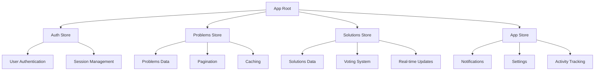

# 🏪 CrowdSolve - Zustand State Management Implementation

## Overview

This document provides a comprehensive guide to the Zustand state management implementation in the CrowdSolve application. We've implemented a multi-store architecture that provides optimal performance, type safety, and developer experience.

## Table of Contents

1. [Architecture Overview](#architecture-overview)
2. [Store Structure](#store-structure)
3. [Implementation Details](#implementation-details)
4. [Usage Patterns](#usage-patterns)
5. [Performance Optimizations](#performance-optimizations)
6. [Best Practices](#best-practices)
7. [Migration Guide](#migration-guide)

---

## Architecture Overview

### Multi-Store Architecture

Instead of using a single monolithic store, we've implemented multiple focused stores:



### Benefits of This Architecture

1. **Separation of Concerns**: Each store handles a specific domain
2. **Performance**: Only components using specific stores re-render
3. **Type Safety**: Each store has its own TypeScript interface
4. **Maintainability**: Easier to debug and modify individual stores
5. **Scalability**: Easy to add new stores for new features

---

## Store Structure

### 1. Auth Store (`lib/stores/auth-store.ts`)

**Purpose**: Manages user authentication and session state.

```typescript
interface AuthStore {
  // State
  user: User | null
  isLoading: boolean
  isAuthenticated: boolean
  hasInitialized: boolean
  
  // Actions
  setUser: (user: User | null) => void
  setLoading: (loading: boolean) => void
  setInitialized: (initialized: boolean) => void
  login: (email: string, password: string) => Promise<void>
  register: (username: string, email: string, password: string) => Promise<void>
  logout: () => Promise<void>
  fetchUser: () => Promise<void>
}
```

**Key Features**:
- JWT-based authentication
- Automatic token refresh
- Prevents infinite API calls
- Session persistence

### 2. Problems Store (`lib/stores/problems-store.ts`)

**Purpose**: Manages problems data with caching and pagination.

```typescript
interface ProblemsStore {
  // State
  problems: Problem[]
  currentProblem: Problem | null
  isLoading: boolean
  isRefreshing: boolean
  error: string | null
  pagination: ProblemsPagination | null
  filters: ProblemFilters
  lastFetched: number | null
  
  // Actions
  fetchProblems: (filters?: Partial<ProblemFilters>, forceRefresh?: boolean) => Promise<void>
  fetchProblemById: (id: string) => Promise<void>
  refreshProblems: () => Promise<void>
  addProblem: (problem: Problem) => void
  updateProblem: (problemId: string, updates: Partial<Problem>) => void
  removeProblem: (problemId: string) => void
  shouldRefresh: () => boolean
}
```

**Key Features**:
- 5-minute intelligent caching
- Pagination support
- Filter management
- Optimistic updates
- Error handling with retry

### 3. Solutions Store (`lib/stores/solutions-store.ts`)

**Purpose**: Manages solutions data with voting and real-time updates.

```typescript
interface SolutionsStore {
  // State
  solutions: Solution[]
  currentSolution: Solution | null
  isLoading: boolean
  isRefreshing: boolean
  error: string | null
  lastFetched: number | null
  userVotes: Record<string, 'upvote' | 'downvote'>
  
  // Actions
  fetchSolutions: (problemId: string, forceRefresh?: boolean) => Promise<void>
  fetchSolutionById: (id: string) => Promise<void>
  voteSolution: (solutionId: string, voteType: 'upvote' | 'downvote') => Promise<void>
  acceptSolution: (solutionId: string) => Promise<void>
  refreshSolutions: (problemId: string) => Promise<void>
  addSolution: (solution: Solution) => void
  updateSolution: (solutionId: string, updates: Partial<Solution>) => void
  removeSolution: (solutionId: string) => void
}
```

**Key Features**:
- 3-minute caching
- Real-time voting system
- User vote tracking
- Optimistic UI updates
- Solution acceptance

### 4. App Store (`lib/stores/app-store.ts`)

**Purpose**: Manages application-wide state and settings.

```typescript
interface AppStore {
  // State
  notifications: Notification[]
  settings: AppSettings
  isOnline: boolean
  lastActivity: number | null
  
  // Actions
  addNotification: (notification: Notification) => void
  markNotificationAsRead: (notificationId: string) => void
  updateSettings: (settings: Partial<AppSettings>) => void
  setOnlineStatus: (isOnline: boolean) => void
  updateLastActivity: () => void
  
  // Computed
  unreadNotificationsCount: number
}
```

**Key Features**:
- Notification management
- User settings persistence
- Online/offline status
- Activity tracking

---

## Implementation Details

### Store Creation Pattern

All stores follow a consistent pattern:

```typescript
export const useStoreName = create<StoreInterface>()(
  persist(
    (set, get) => ({
      // Initial state
      // Actions
    }),
    {
      name: 'store-name',
      partialize: (state) => ({
        // Select which parts of state to persist
      })
    }
  )
)
```

### Caching Strategy

#### Intelligent Refresh Detection

```typescript
const CACHE_DURATION = 5 * 60 * 1000 // 5 minutes

shouldRefresh: () => {
  const { lastFetched } = get()
  return !lastFetched || Date.now() - lastFetched > CACHE_DURATION
}
```

#### Smart Fetching

```typescript
fetchData: async (forceRefresh = false) => {
  const state = get()
  
  // Check if we should refresh
  if (!forceRefresh && !state.shouldRefresh() && state.data.length > 0) {
    return // Use cached data
  }

  try {
    set({ isLoading: true, error: null })
    
    const response = await fetch('/api/endpoint')
    const data = await response.json()
    
    set({
      data: normalizedData,
      lastFetched: Date.now(),
      isLoading: false
    })
  } catch (error) {
    set({ error: error.message, isLoading: false })
  }
}
```

### Error Handling

#### Comprehensive Error States

```typescript
interface StoreState {
  error: string | null
  isLoading: boolean
  isRefreshing: boolean
}

// In actions
try {
  // API call
} catch (error: any) {
  console.error('Store error:', error)
  set({
    error: error.message || 'An unexpected error occurred',
    isLoading: false,
    isRefreshing: false
  })
}
```

#### User-Friendly Error Messages

```typescript
const getErrorMessage = (error: any): string => {
  if (error.name === 'TimeoutError') {
    return 'Request timed out. Please check your connection.'
  }
  if (error.message.includes('HTTP error')) {
    return `Server error (${error.message.split('status: ')[1]}). Please try again later.`
  }
  return error.message || 'An unexpected error occurred'
}
```

### Data Normalization

#### Consistent Data Structures

```typescript
const normalizeProblem = (problem: any): Problem => ({
  ...problem,
  tags: Array.isArray(problem.tags) ? problem.tags : [],
  images: Array.isArray(problem.images) ? problem.images : [],
  author: problem.author || { 
    _id: 'unknown', 
    username: 'Unknown', 
    avatar: null, 
    reputation: 0 
  },
  status: problem.status || 'open',
  views: problem.views || 0
})
```

---

## Usage Patterns

### 1. Basic Store Usage

```typescript
import { useProblemsStore } from '@/lib/stores/problems-store'

function ProblemsList() {
  const { 
    problems, 
    isLoading, 
    error, 
    fetchProblems, 
    refreshProblems 
  } = useProblemsStore()

  useEffect(() => {
    fetchProblems()
  }, [fetchProblems])

  if (isLoading) return <div>Loading...</div>
  if (error) return <div>Error: {error}</div>

  return (
    <div>
      {problems.map(problem => (
        <ProblemCard key={problem._id} problem={problem} />
      ))}
    </div>
  )
}
```

### 2. Optimistic Updates

```typescript
const voteSolution = async (solutionId: string, voteType: 'upvote' | 'downvote') => {
  // Optimistic update
  set((state) => ({
    solutions: state.solutions.map(solution =>
      solution._id === solutionId 
        ? { ...solution, votes: solution.votes + (voteType === 'upvote' ? 1 : -1) }
        : solution
    )
  }))

  try {
    const response = await fetch(`/api/solutions/${solutionId}/vote`, {
      method: 'POST',
      body: JSON.stringify({ voteType })
    })
    
    if (!response.ok) {
      // Rollback on error
      set((state) => ({
        solutions: state.solutions.map(solution =>
          solution._id === solutionId 
            ? { ...solution, votes: solution.votes - (voteType === 'upvote' ? 1 : -1) }
            : solution
        )
      }))
      throw new Error('Vote failed')
    }
  } catch (error) {
    // Error handling
    set({ error: 'Failed to vote on solution' })
  }
}
```

### 3. Conditional Fetching

```typescript
const fetchProblems = async (filters = {}, forceRefresh = false) => {
  const state = get()
  
  // Only fetch if needed
  if (!forceRefresh && !state.shouldRefresh() && state.problems.length > 0) {
    return
  }

  // Fetch logic...
}
```

### 4. Store Composition

```typescript
function ProblemDetail({ problemId }: { problemId: string }) {
  const { currentProblem, fetchProblemById } = useProblemsStore()
  const { solutions, fetchSolutions } = useSolutionsStore()
  const { user } = useAuth()

  useEffect(() => {
    fetchProblemById(problemId)
    fetchSolutions(problemId)
  }, [problemId, fetchProblemById, fetchSolutions])

  // Component logic...
}
```

---

## Performance Optimizations

### 1. Selective Re-renders

```typescript
// Only re-render when specific state changes
const { problems, isLoading } = useProblemsStore(
  (state) => ({ 
    problems: state.problems, 
    isLoading: state.isLoading 
  })
)
```

### 2. Memoized Selectors

```typescript
const useProblemById = (id: string) => {
  return useProblemsStore(
    useCallback(
      (state) => state.problems.find(problem => problem._id === id),
      [id]
    )
  )
}
```

### 3. Persistence Strategy

```typescript
// Only persist essential data
persist(
  (set, get) => ({
    // Store implementation
  }),
  {
    name: 'problems-store',
    partialize: (state) => ({
      problems: state.problems,
      filters: state.filters,
      lastFetched: state.lastFetched
    })
  }
)
```

### 4. Request Deduplication

```typescript
const fetchData = async () => {
  const state = get()
  
  // Prevent duplicate requests
  if (state.isLoading) return
  
  set({ isLoading: true })
  // Fetch logic...
}
```

---

## Best Practices

### 1. Store Design

#### ✅ Do
- Keep stores focused on a single domain
- Use descriptive action names
- Implement proper error handling
- Add TypeScript interfaces
- Use optimistic updates where appropriate

#### ❌ Don't
- Put unrelated state in the same store
- Use generic action names like `setData`
- Ignore error states
- Skip type definitions
- Always wait for server responses

### 2. Component Integration

#### ✅ Do
```typescript
// Use specific selectors
const { problems, isLoading } = useProblemsStore(
  (state) => ({ 
    problems: state.problems, 
    isLoading: state.isLoading 
  })
)

// Handle loading and error states
if (isLoading) return <LoadingSpinner />
if (error) return <ErrorMessage error={error} />
```

#### ❌ Don't
```typescript
// Don't select entire store
const store = useProblemsStore()

// Don't ignore loading states
return <div>{problems.map(...)}</div>
```

### 3. Error Handling

#### ✅ Do
```typescript
const fetchData = async () => {
  try {
    set({ isLoading: true, error: null })
    const response = await fetch('/api/endpoint')
    
    if (!response.ok) {
      throw new Error(`HTTP error! status: ${response.status}`)
    }
    
    const data = await response.json()
    set({ data, isLoading: false })
  } catch (error: any) {
    set({ 
      error: error.message || 'An unexpected error occurred',
      isLoading: false 
    })
  }
}
```

#### ❌ Don't
```typescript
const fetchData = async () => {
  const response = await fetch('/api/endpoint')
  const data = await response.json()
  set({ data }) // No error handling
}
```

### 4. Caching Strategy

#### ✅ Do
```typescript
// Implement intelligent caching
const shouldRefresh = () => {
  const { lastFetched } = get()
  return !lastFetched || Date.now() - lastFetched > CACHE_DURATION
}

// Check cache before fetching
if (!forceRefresh && !shouldRefresh() && data.length > 0) {
  return
}
```

#### ❌ Don't
```typescript
// Always fetch data
const fetchData = async () => {
  // Always makes API call
}
```

---

## Migration Guide

### From useState to Zustand

#### Before (useState)
```typescript
function ProblemsList() {
  const [problems, setProblems] = useState<Problem[]>([])
  const [isLoading, setIsLoading] = useState(true)
  const [error, setError] = useState<string | null>(null)

  const fetchProblems = async () => {
    try {
      setIsLoading(true)
      const response = await fetch('/api/problems')
      const data = await response.json()
      setProblems(data.problems)
    } catch (error) {
      setError('Failed to fetch problems')
    } finally {
      setIsLoading(false)
    }
  }

  useEffect(() => {
    fetchProblems()
  }, [])

  return (
    <div>
      {isLoading && <div>Loading...</div>}
      {error && <div>Error: {error}</div>}
      {problems.map(problem => (
        <ProblemCard key={problem._id} problem={problem} />
      ))}
    </div>
  )
}
```

#### After (Zustand)
```typescript
function ProblemsList() {
  const { 
    problems, 
    isLoading, 
    error, 
    fetchProblems 
  } = useProblemsStore()

  useEffect(() => {
    fetchProblems()
  }, [fetchProblems])

  return (
    <div>
      {isLoading && <div>Loading...</div>}
      {error && <div>Error: {error}</div>}
      {problems.map(problem => (
        <ProblemCard key={problem._id} problem={problem} />
      ))}
    </div>
  )
}
```

### Benefits of Migration

1. **Reduced Boilerplate**: No need to manage loading/error states in every component
2. **Shared State**: Multiple components can access the same data
3. **Caching**: Automatic caching with intelligent refresh
4. **Type Safety**: Full TypeScript support
5. **Performance**: Only re-render when specific state changes

---

## Troubleshooting

### Common Issues

#### 1. Infinite Re-renders
```typescript
// ❌ Problem: Creating new objects in selectors
const { data } = useStore((state) => ({ data: state.data }))

// ✅ Solution: Use stable selectors
const data = useStore((state) => state.data)
```

#### 2. Stale Closures
```typescript
// ❌ Problem: Using stale state in callbacks
const handleClick = () => {
  console.log(problems) // Might be stale
}

// ✅ Solution: Use get() to access current state
const handleClick = () => {
  const currentProblems = get().problems
  console.log(currentProblems)
}
```

#### 3. Memory Leaks
```typescript
// ❌ Problem: Not cleaning up subscriptions
useEffect(() => {
  const unsubscribe = store.subscribe(handleChange)
  // Missing cleanup
}, [])

// ✅ Solution: Clean up subscriptions
useEffect(() => {
  const unsubscribe = store.subscribe(handleChange)
  return unsubscribe
}, [])
```

### Debugging Tips

#### 1. Enable DevTools
```typescript
import { devtools } from 'zustand/middleware'

export const useStore = create<StoreInterface>()(
  devtools(
    persist(
      (set, get) => ({
        // Store implementation
      }),
      { name: 'store-name' }
    )
  )
)
```

#### 2. Add Logging
```typescript
const fetchData = async () => {
  console.log('Fetching data...')
  try {
    // Fetch logic
    console.log('Data fetched successfully')
  } catch (error) {
    console.error('Fetch error:', error)
  }
}
```

#### 3. Monitor State Changes
```typescript
// Add to store
const store = useStore()
useEffect(() => {
  console.log('Store state changed:', store)
}, [store])
```

---

## Conclusion

The Zustand implementation in CrowdSolve provides a robust, performant, and maintainable state management solution. By using multiple focused stores with intelligent caching, optimistic updates, and comprehensive error handling, we've created a system that scales well and provides an excellent developer experience.

Key takeaways:
- Use multiple focused stores instead of one monolithic store
- Implement intelligent caching with refresh detection
- Handle errors comprehensively with user-friendly messages
- Use optimistic updates for better UX
- Normalize data consistently across stores
- Follow TypeScript best practices for type safety

This architecture will serve as a solid foundation for future feature development and can be easily extended as the application grows.
